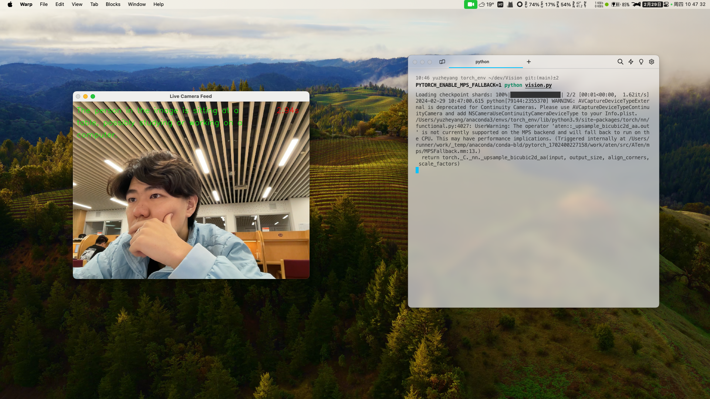

# Vision

## Introduction

This project leverages the advanced capabilities of the [MiniCPM-V](MiniCPM-V/README.md) (i.e., OmniLMM-3B), to bring cutting-edge image recognition to real-time camera feeds. By harnessing the power of this model, the application can analyze and understand scenes captured by the camera, providing instant feedback on what it perceives. You can modify the prompt to see how the model responds to different inputs.



## How to use this repository

1. Download the MiniCPM-V from the [model1](https://huggingface.co/openbmb/MiniCPM-V/resolve/main/model-00001-of-00002.safetensors?download=true) and [model2](https://huggingface.co/openbmb/MiniCPM-V/resolve/main/model-00002-of-00002.safetensors?download=true) links. And put them in the `MiniCPM-V` folder.

2. Install the requirements by running `pip install -r requirements.txt`.

3. To start the image recognition application, use the run.sh script with one of the following device options: mps, cpu, or cuda. For example:

    ```bash
    ./run.sh mps   # For running on Apple Silicon GPU
    ./run.sh cpu   # For running on CPU
    ./run.sh cuda  # For running on CUDA-enabled GPU
    ```

    Ensure you have given execution permissions to the script by running `chmod +x run.sh` if necessary.

4. Quit the application by pressing `q`.
